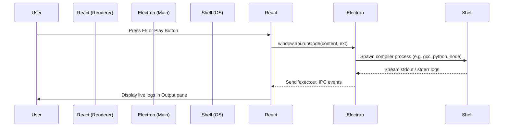
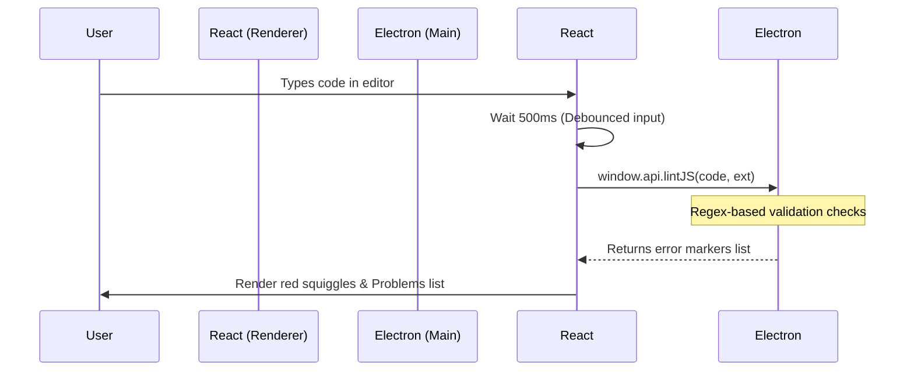
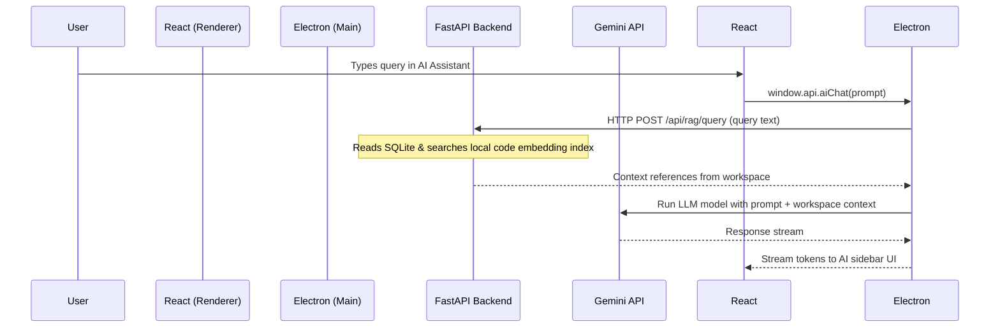

# 🌌 Atmos IDE — Project Structure & Architecture Guide

Welcome to the **Atmos IDE** workspace! This guide explains the project structure, how the different components fit together, and how data flows through the application.

---

## 🗂 Directory Map

The codebase is organized as a clean hybrid monorepo consisting of a **Python Backend** and an **Electron/React Desktop Application**.

```
atmos-ide/
├── backend/                  # 🐍 Python FastAPI Backend
│   ├── main.py               #   Entry point, FastAPI routes, and WebSocket endpoints
│   ├── config.py             #   App configurations, logs, and path helpers
│   ├── auth_manager.py       #   User password hashing and JWT token generator
│   ├── db_manager.py         #   SQLite client manager initialization
│   ├── rag_manager.py        #   AI RAG database (code search, vector embeddings)
│   └── requirements.txt      #   Python dependencies list
│
├── electron/                 # 🖥️ Electron Main Process (Desktop Wrapper)
│   ├── main.js               #   IPC event handlers, filesystem access, subprocess spawn
│   └── preload.js            #   Secure ContextBridge mapping main process APIs to window
│
├── frontend/                 # ⚡ React Frontend App (runs in Chrome browser window)
│   ├── main.jsx              #   React bootstrap mounting App.jsx
│   ├── App.jsx               #   Main layout shell, state router, tabs tracker
│   ├── components/           #   Reusable React UI Components:
│   │   ├── TitleBar/         #     Top window controls and actions
│   │   ├── ActivityBar/      #     Left nav bar for switching views
│   │   ├── Sidebar/          #     File Explorer, Git, Extensions pane
│   │   ├── EditorArea/       #     Monaco Editor integration with file tabs
│   │   ├── BottomPanel/      #     Problems, Output console, xterm.js terminal
│   │   ├── CommandPalette/   #     Search tool overlay (Ctrl+Shift+P)
│   │   └── Notifications/    #     Toast alerts
│   │
│   ├── panels/               #   Full overlays (Settings, Account, Snippets)
│   ├── hooks/                #   React custom state hooks (useFiles, useSettings)
│   └── utils/                #   Helper functions (browser shims, languages config)
│
├── db.sqlite3                # 💾 SQLite Database (created automatically)
├── package.json              # 📦 Frontend npm configuration and scripts
├── tailwind.config.js        # 🎨 Tailwind CSS layout settings
└── vite.config.js            # ⚡ Vite frontend bundler configuration
```

---

## 🔄 Core Data & Execution Flows

Atmos IDE bridges JavaScript (front-end) and Python (RAG / database) together. Here is how the systems interact:

### 1. Code Execution (Running files)


### 2. Live Syntax Validation & Linter


### 3. AI Chat & Codebase RAG


---

## 🛠 Building & Development Scripts

- **`npm run dev`**: Starts the concurrently orchestrated dev environment:
  1. Bootstraps FastAPI Python server (`backend/main.py`) using Uvicorn.
  2. Runs Vite dev server for the React app on `http://localhost:5174`.
  3. Launches Electron and points the browser window to Vite.
- **`npm run build`**: Compiles Vite JS assets to a production bundle (`/dist`) and prepares files to be packaged by `electron-builder`.
